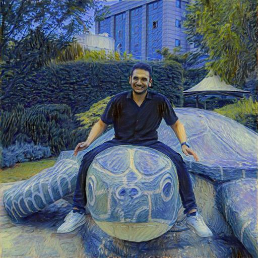

# Neural Style Transfer

In this project, I use a CNN to generate an image in pixels near to **content** image, but in high-level features near to **style** image.

## Usage

Upload your input image to `Images/Neural_Transfer` folder and change the `NAME` in [script.py](./script.py). Then run this python file:

```terminal
python3 script.py
```

It will take a few minutes to do an optimization, then your result image is ready in `Images/Neural_Transfer/[image name]_result.jpg`.

### Example

With this input image as content  and the style image  get the result 

The exact details of implementation is available at [Neural_Style_Transfer notebook](./Neural_Style_Transfer.ipynb)
